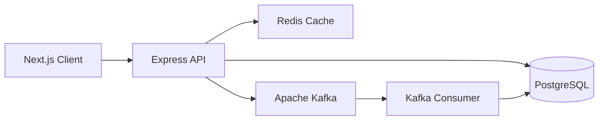

# 🚀 Scalable Real-Time Chat Application

A modern, scalable chat application built with Next.js, Express, Redis, and Apache Kafka. This application demonstrates real-time messaging capabilities with distributed system architecture.

## ✨ Features

- 🔐 Secure authentication with Google OAuth
- 💬 Real-time messaging using Socket.IO
- 📡 Message queueing with Apache Kafka
- 🔄 Redis for session management and caching
- 🎯 TypeScript for type safety
- 🎨 Modern UI with Tailwind CSS
- 🔍 Message persistence with PostgreSQL
- 🌐 Scalable architecture

## 🏗️ Architecture



## 🛠️ Tech Stack

### Frontend
- Next.js 14
- TypeScript
- Tailwind CSS
- Socket.IO Client
- Next-Auth
- Radix UI Components

### Backend
- Express.js
- Node-rdkafka
- Socket.IO
- Redis Streams
- Prisma ORM
- PostgreSQL

## 📦 Prerequisites

- Node.js >= 18
- Redis Server
- Apache Kafka
- PostgreSQL
- Aiven Account (for Kafka service)

## 🚀 Getting Started

1. **Clone the repository**
```bash
git clone https://github.com/yourusername/kafka-redis-chat-app.git
cd kafka-redis-chat-app
```

2. **Install dependencies**
```bash
# Install server dependencies
cd server
pnpm install

# Install client dependencies
cd ../client
pnpm install
```

3. **Configure Environment Variables**

Server (.env):
```env
PORT=8000
CLIENT_APP_URL=http://localhost:3001
APP_URL=http://localhost:8000
JWT_SECRET=your_jwt_secret

# Database
DATABASE_URL=your_postgresql_url

# Kafka Configuration
KAFKA_BROKER=your_kafka_broker
KAFKA_USERNAME=your_username
KAFKA_PASSWORD=your_password
KAFKA_TOPIC=chats
KAFKA_SSL_ENABLED=true

# Redis Configuration
REDIS_HOST=localhost
REDIS_PORT=6379
```

Client (.env.local):
```env
NEXT_PUBLIC_BACKEND_URL=http://localhost:8000
GOOGLE_CLIENT_ID=your_google_client_id
GOOGLE_CLIENT_SECRET=your_google_client_secret
```

4. **Set up the Database**
```bash
cd server
npx prisma migrate dev
```

5. **Start the Development Servers**
```bash
# Start the backend server
cd server
pnpm dev

# Start the frontend application
cd client
pnpm dev
```

## 📁 Project Structure

```
├── client/                 # Next.js frontend
│   ├── src/
│   │   ├── app/           # Next.js app router
│   │   ├── components/    # React components
│   │   ├── lib/          # Utilities and configs
│   │   └── validations/  # Schema validations
│   └── public/           # Static assets
│
├── server/                # Express backend
│   ├── src/
│   │   ├── config/       # Configuration files
│   │   ├── controllers/  # Route controllers
│   │   ├── middleware/   # Express middleware
│   │   └── routes/       # API routes
│   └── prisma/          # Database schema
```

## 🔒 Security

- SSL/TLS encryption for Kafka connections
- JWT authentication for API routes
- Google OAuth2.0 integration
- Secure session management with Redis
- Input validation and sanitization

## 🔍 Monitoring

- Socket.IO Admin UI for real-time monitoring
- Kafka Consumer lag monitoring
- Redis metrics tracking
- API endpoint monitoring

## 🤝 Contributing

1. Fork the repository
2. Create your feature branch (`git checkout -b feature/amazing-feature`)
3. Commit your changes (`git commit -m 'Add some amazing feature'`)
4. Push to the branch (`git push origin feature/amazing-feature`)
5. Open a Pull Request

## 📄 License

This project is licensed under the MIT License - see the [LICENSE](LICENSE) file for details

## 👏 Acknowledgments

- [Next.js Documentation](https://nextjs.org/docs)
- [Apache Kafka Documentation](https://kafka.apache.org/documentation/)
- [Redis Documentation](https://redis.io/docs/)
- [Socket.IO Documentation](https://socket.io/docs/v4/)

## 📞 Contact

Your Name - [@Nobody_crypto_H](https://x.com/Nobody_crypto_H)
Project Link: [https://github.com/Harmeet10000/kafka-redis-chat-app](https://github.com/Harmeet10000/kafka-redis-chat-app)